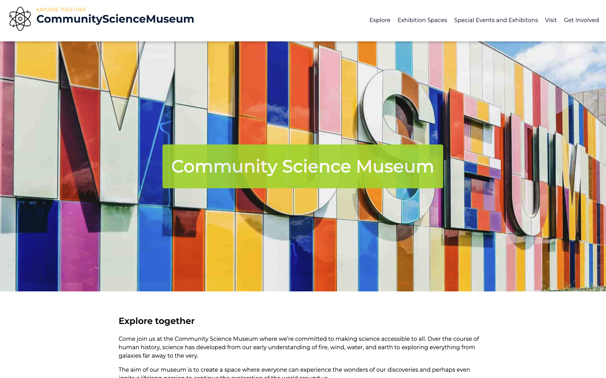

# Semester Project



## Description

This project is an informational website for a community science museum. The site is designed to provide visitors with comprehensive information about the museum, including exhibits, events, visitor information, and contact details. It aims to offer a clean, user-friendly interface to help visitors easily find the information they need.

Key features of the project include:
- Detailed information about the museum's exhibits
- A section for upcoming events and activities
- Visitor information, including hours of operation and location
- A contact page with museum contact details

## Built With

- HTML
- CSS

## Getting Started

### Installing

1. Clone the repo:

```bash
git clone git@github.com:Daniel-leiken/Semester-project-1.git
```

### Running

To run the app, open index.html in your web browser:

Open the index.html file in your preferred web browser. You can do this by double-clicking the file or by opening it from the browser's file menu.

## Contributing

Contributions are what make the open-source community such an amazing place to learn, inspire, and create. Any contributions you make are greatly appreciated.

To contribute to this project, follow these steps:

1. Fork the Project: Click on the "Fork" button at the top of the repository page to create a copy of the repository on your GitHub account.

2. Clone the Forked Repository: Clone your forked repository to your local machine:
git clone https://github.com/your-username/Community-science-museum.git

3. Create a New Branch: Create a new branch for your feature or bugfix:
git checkout -b feature/YourFeatureName

4. Make Your Changes: Implement your feature or fix the bug.

5. Commit Your Changes: Commit your changes with a meaningful commit message:
git commit -m 'Add feature: YourFeatureName'

6. Push to Your Branch: Push your changes to your forked repository:
git push origin feature/YourFeatureName

7. Open a Pull Request: Open a pull request to merge your changes into the main repository. Provide a detailed description of your changes and any additional context that may be useful for the reviewers.

## Guidelines

- Ensure your code follows the project's coding standards.
- Update the documentation if necessary.
- Test your changes thoroughly before submitting.
- Be descriptive in your pull request and provide as much context as possible.

## Contact

This is where you can leave your social links for people to contact you, such as a LinkedIn profile or Twitter link e.g.

[My LinkedIn page](www.linkedin.com/in/daniel-strandheim/)